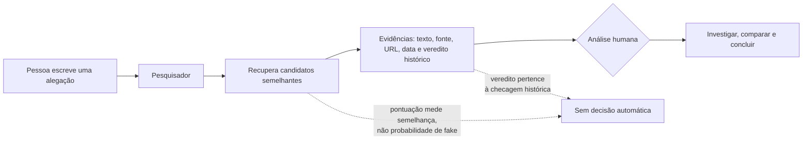
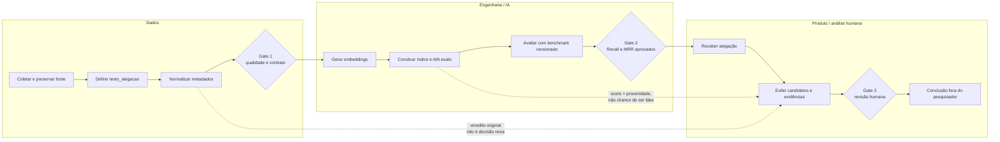

# Pipeline e contratos do Pesquisador RES-IA

## Objetivo deste documento

Explicar o caminho dos dados, o papel de cada componente e os pontos em que o trabalho deve parar para validação. A referência é o commit `d2791aa`; itens futuros são propostas, não funcionalidades confirmadas.

## Visão de uso

Em termos simples: o serviço funciona como uma busca especializada. Ele reduz o acervo que a pessoa precisa ler, mas não substitui a investigação.

## Pipeline em faixas e gates

### O que cada gate protege

| Gate | Pergunta obrigatória | Evidência esperada |
| --- | --- | --- |
| 1 — Dados | O texto representa uma alegação e os metadados são rastreáveis? | Regras documentadas, IDs, URLs, datas, duplicatas e exceções. |
| 2 — Engenharia/IA | A busca encontra a referência correta sem confundir somente o tema? | Benchmark separado do desenvolvimento, Recall@1/3/5 e MRR por categoria. |
| 3 — Humano | As evidências recuperadas realmente se aplicam à nova alegação? | Leitura das fontes, contexto, cobertura e justificativa registrada. |

## Contrato dos dados

| Campo | Significado simples | Regra sugerida |
| --- | --- | --- |
| `id` | Identificador estável do registro. | Não reutilizar nem depender da posição da linha. |
| `noticia_publicacao` | Página publicada pela agência, contendo a checagem completa. | Preservar título, corpo, fonte e data quando disponíveis. |
| `texto_alegacao` | Frase canônica que resume exatamente o conteúdo verificado. | Definir com Dados; não assumir que o título da matéria é a alegação. |
| `checagem` | Análise e evidências produzidas pela agência. | Não confundir com a pergunta do usuário nem com palavras filtradas. |
| `veredito_original` | Rótulo dado pela agência à checagem histórica. | Preservar; uma versão normalizada deve ficar em outro campo. |
| `agencia` | Organização responsável pela checagem. | Usar nome padronizado e manter a origem. |
| `pontuacao` | Grau de proximidade entre consulta e candidato. | Não apresentar como probabilidade de falsidade ou verdade. |
| `url` | Endereço da fonte que permite auditoria. | Validar formato, disponibilidade e duplicidade. |
| `data_publicacao` | Data da checagem ou publicação. | Guardar a precisão conhecida e sinalizar datas ambíguas. |
| `escopo_coberto` | Parte da alegação que a checagem realmente avaliou. | Marcar cobertura total, parcial ou incerta. |

## Como avaliar a recuperação

Uma consulta positiva conhece previamente o `id_referencia` correto. Se ele aparece entre os primeiros resultados, a recuperação acertou naquele corte. Um caso `sem_match` não tem ID de referência e testa se o sistema evita aparentar certeza quando não há correspondência.

- **Recall@1, @3 e @5:** em quantas consultas positivas a referência apareceu nas primeiras 1, 3 ou 5 posições.
- **MRR:** dá mais valor quando a referência correta aparece mais perto do topo.
- **Categorias:** paráfrase, gíria, apelido, erro de escrita, negação, recorrência temporal e controles negativos.
- **Separação:** desenvolvimento e teste não podem compartilhar a mesma alegação subjacente, mesmo que o texto seja diferente.

O índice deve registrar corpus e hash, campo textual, modelo e revisão, versão do pipeline, benchmark e data. Para o volume atual, o k-NN exato é simples, auditável e suficiente; banco vetorial ou ANN não é prioridade.

## Limites obrigatórios na interface

1. Um candidato pode falar do mesmo tema e ainda tratar de outra alegação.
2. O veredito antigo pode cobrir só parte da nova frase ou outro contexto temporal.
3. Agências podem usar escalas distintas ou divergir; isso deve ser mostrado.
4. Ausência de candidato não prova que a alegação é verdadeira.

## Resumo final da etapa

O pipeline organiza dados, transforma alegações em vetores, procura vizinhos e entrega evidências. Três travas evitam conclusões indevidas: qualidade do dado, avaliação da busca e revisão humana. A pontuação só diz “estes textos parecem próximos”; ela nunca diz, sozinha, “isto é fake”.
