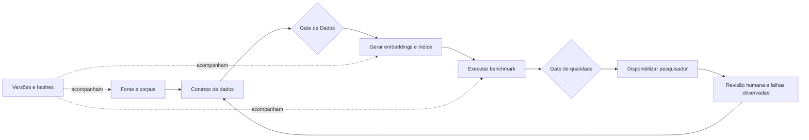

# MLOps aplicado ao RES-IA

## Por que este assunto entra no projeto

MLOps é a forma de transformar um experimento de Machine Learning em um processo repetível, verificável e operável. No RES-IA, isso não significa começar com infraestrutura pesada. Significa conseguir responder, com evidências: **qual dado entrou, qual transformação ocorreu, qual modelo foi usado, qual teste mediu a qualidade e quem aprovou a mudança**.

Este guia traduz o artigo *Machine Learning Operations (MLOps): Overview, Definition, and Architecture*, de Kreuzberger, Kühl e Hirschl (IEEE Access, 2023, DOI `10.1109/ACCESS.2023.3262138`), para o estágio atual do projeto. O [PDF estudado](../refs/3428658.3430965.pdf) é uma fonte acadêmica, não uma instrução operacional do repositório.

## Nosso MLOps mínimo

### O que aplicar agora

| Princípio do artigo | Tradução simples | Aplicação no RES-IA |
| --- | --- | --- |
| Reprodutibilidade | Outra pessoa consegue repetir. | Comando único, dependências e entradas registradas. |
| Versionamento | Sabemos exatamente qual versão gerou o resultado. | Hash do corpus, commit, modelo/revisão, contrato e benchmark. |
| Metadados | Cada execução deixa uma ficha. | Parâmetros, métricas, data, duração, arquivos e falhas. |
| Colaboração | As áreas não decidem isoladamente. | Gates entre Dados, Produto, IA e Engenharia. |
| Avaliação contínua | Mudanças são comparadas com a referência. | Recall@1/3/5 e MRR por categoria antes de promover um índice. |
| Feedback | Erros voltam para o processo. | Falso positivo ou ambiguidade alimenta benchmark e regra de dados. |

## Quem faz o quê

| Papel do projeto | Responsabilidade principal | Evidência entregue |
| --- | --- | --- |
| `dominio-dados` | Define e valida alegações, origem, qualidade e elegibilidade. | Contrato, guia de anotação e relatório de qualidade. |
| `produto-decisao` | Define o que é resultado útil, cobertura parcial, ambiguidade e comunicação responsável. | Cenários, critérios de aceite e limites da resposta. |
| IA/Modelos | Compara representações e mede a recuperação. | Experimentos e métricas por estrato. |
| Engenharia | Implementa contratos, automação, integridade e entrega técnica. | Pipeline reproduzível, manifesto e testes. |
| Arquitetura | Conecta decisões, dependências, riscos e gates. | ADRs, diagramas, contratos e rastreabilidade ponta a ponta. |

Arquitetura não substitui os especialistas. Ela garante que uma decisão de Dados seja entendida por Produto e respeitada por Engenharia.

## O que fica para depois

- Registro formal de modelos e índices com estados como experimental, aprovado e substituído.
- Monitoramento real de qualidade, latência, `sem_match` e revisões humanas.
- Reindexação controlada quando mudar corpus, contrato ou modelo.
- Orquestrador de workflows quando houver várias fontes e execuções recorrentes.

## O que não precisamos agora

Kubernetes, GPUs, feature store, Spark, Kafka, ANN e banco vetorial distribuído não resolvem o problema mais urgente. Com aproximadamente 1.882 registros, k-NN exato continua simples e auditável. Essas tecnologias só devem entrar quando uma necessidade medida justificar custo e complexidade.

## Checklist de promoção de um índice

- [ ] `texto_alegacao` e elegibilidade aprovados por Dados e Produto.
- [ ] Corpus, contrato, código, modelo e benchmark possuem versão ou hash.
- [ ] Splits não compartilham a mesma família de alegação.
- [ ] Recall@1/3/5 e MRR foram calculados por categoria.
- [ ] Falhas e negativos difíceis foram revisados.
- [ ] Manifesto liga cada vetor a um `claim_id` rastreável.
- [ ] Resposta informa que pontuação não é probabilidade de falsidade.
- [ ] Existe forma segura de voltar para o índice anterior.

## Resumo final da etapa

MLOps, neste projeto, é primeiro uma disciplina de rastreabilidade e colaboração. A arquitetura deve ligar dados, índice, benchmark, resposta e responsáveis. A infraestrutura mais complexa fica para quando o uso real provar essa necessidade.
