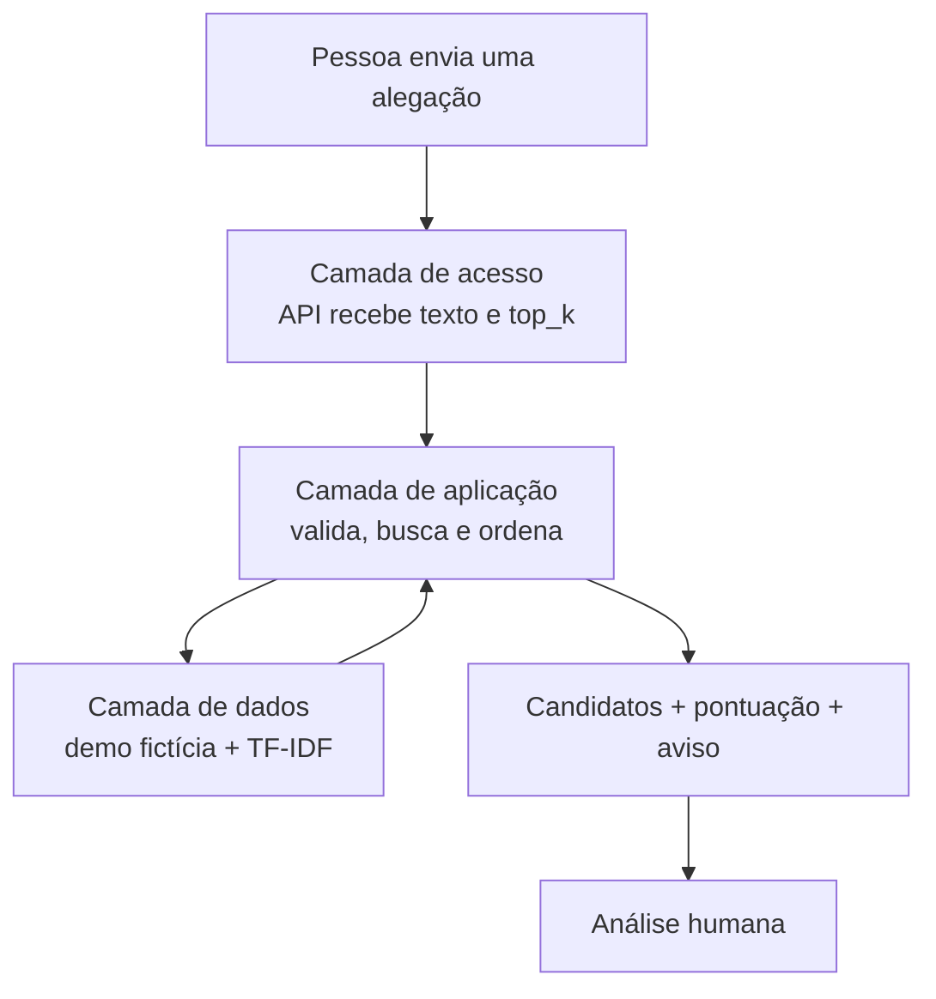
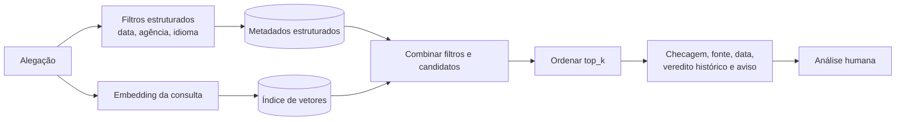
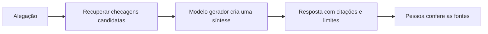

# Modelos visuais de arquitetura

## Como ler este guia

Os três desenhos respondem perguntas diferentes. A arquitetura em camadas organiza responsabilidades. A pesquisa híbrida combina filtros e semelhança. RAG acrescenta uma IA que redige uma resposta baseada nas fontes recuperadas.

## 1. Arquitetura tradicional em três camadas

Esta é a explicação mais próxima da demonstração atual.

- **Acesso:** porta de entrada.
- **Aplicação:** coordena as regras da consulta.
- **Dados:** mantém checagens e representações pesquisáveis.
- **Limite:** organizar camadas não prova a qualidade da recuperação.

## 2. Pesquisa híbrida: dados estruturados + vetores

É uma evolução possível, ainda não confirmada como produto implementado.

Os dados estruturados funcionam como uma ficha organizada. Os vetores ajudam a comparar sentidos próximos. “SQL + vetores” descreve responsabilidades; não obriga a adotar dois bancos. No volume atual, metadados e k-NN exato em artefatos locais podem cumprir o papel com menos complexidade.

## 3. RAG: recuperação mais geração

RAG somente existe quando, depois da busca, um modelo gerador escreve uma resposta usando as fontes recuperadas.

> [!WARNING]
> O RES-IA atual não deve ser chamado de RAG. Há recuperação de candidatos, mas não há evidência de um modelo gerador produzindo uma síntese fundamentada.

Se RAG entrar no futuro, serão necessários citações por afirmação, recusa sem evidência, proteção contra instruções maliciosas presentes no corpus e testes de fidelidade da resposta.

## Comparação rápida

| Modelo | Pergunta respondida | Estado no RES-IA | Principal limite |
| --- | --- | --- | --- |
| Três camadas | Onde fica cada responsabilidade? | Compatível com a demo implementada. | Não mede qualidade semântica. |
| Pesquisa híbrida | Como filtrar dados e buscar por sentido? | Possibilidade futura/experimental. | Exige contratos e benchmark. |
| RAG | Como gerar uma explicação baseada nas fontes? | Não existente. | Pode inventar ou resumir incorretamente. |

## Resumo final da etapa

Hoje, o RES-IA é melhor explicado como um pesquisador em camadas. A pesquisa híbrida é uma possibilidade de evolução, não uma obrigação tecnológica. RAG é outro passo: além de recuperar, uma IA passaria a escrever; por isso exige novos controles e não descreve o sistema atual.
